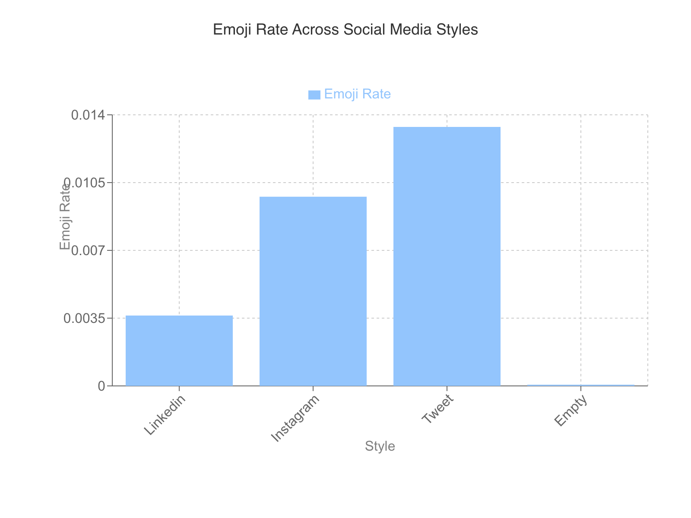
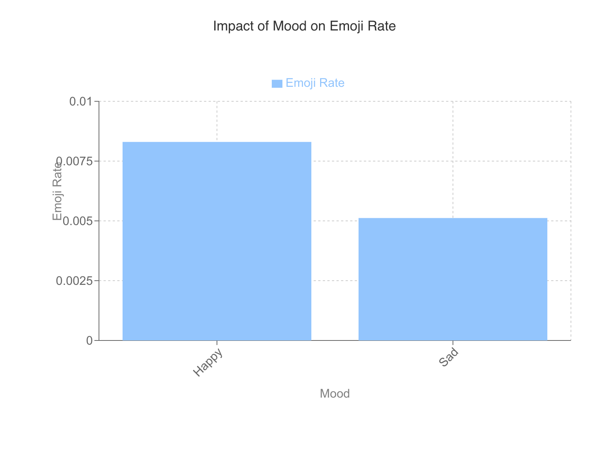
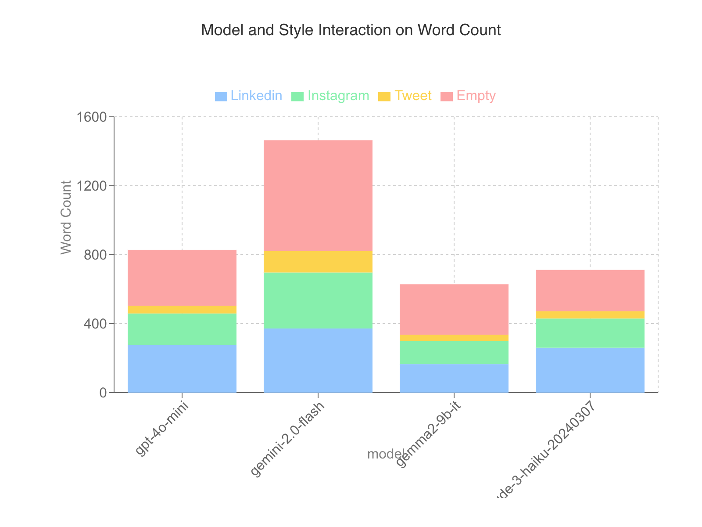
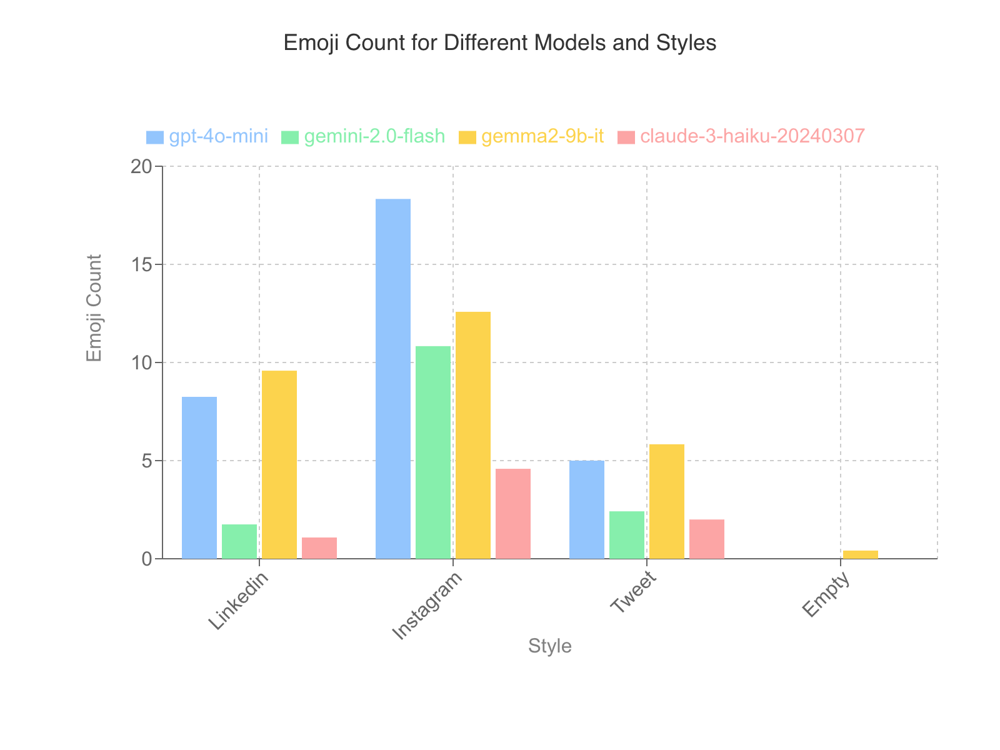

# Analysis of Emoji Usage in Language Model Outputs Across Different Social Media Post Styles

**Author:** Your Name  
**Date:** March 14, 2025  
**Generated with:** GPT-4

## Table of Contents

1. [Introduction](#introduction)
   1.1. [Background](#background)
   1.2. [Objectives](#objectives)
2. [Methodology](#methodology)
   2.1. [Experimental Design](#experimental-design)
   2.2. [Data Collection](#data-collection)
   2.3. [Statistical Analysis](#statistical-analysis)
3. [Results](#results)
   3.1. [Emoji Usage Across Styles](#emoji-usage-across-styles)
   3.2. [Impact of Mood and Models](#impact-of-mood-and-models)
   3.3. [Interaction Effects](#interaction-effects)
4. [Discussion](#discussion)
   4.1. [Interpretation of Findings](#interpretation-of-findings)
5. [Conclusion](#conclusion)
   5.1. [Key Conclusions](#key-conclusions)
   5.2. [Next Steps](#next-steps)

## Introduction

The purpose of this study is to investigate the influence of various factors, including mood and style, on the utilization of emojis by language models within different social media contexts. The study is grounded in an experimental approach that employs a factorial Analysis of Variance (ANOVA) design to systematically explore the interactions and main effects of independent variables on multiple response variables related to text output. The language models assessed in this research include gpt-4o-mini, gemini-2.0-flash, gemma2-9b-it, and claude-3-haiku-20240307.

A central component of this study is the analysis of how mood, categorized into "Happy" and "Sad," alongside different styles pertinent to social media platforms such as LinkedIn, Instagram, and Twitter, affects emoji usage. The factorial design facilitates the identification of both direct and interaction effects of these factors on variables such as emoji rate, emoji count, word count, character count, and sentence count in generated text outputs.

Statistical measures employed in the study reveal significant main effects and interactions, offering insight into how these factors drive differences in emoji usage and text characteristics among the language models. Notably, significant results were detected for the main effects of model and style on emoji rate, indicating that these factors substantially inform the variance in emoji utilization across different contexts.

The interaction effects highlight complex interactions between mood, style, and model, underscoring the nuanced nature of language model outputs in response to varied social media stimuli. These findings provide evidence that emoji usage can be considered a reflection of mood and style as perceived and enacted by language models across distinct social media platforms.

Throughout this introduction, several graphs provide visual representation of critical results:

- The influence of various styles on emoji rate is depicted in the graph below, offering a comparative visual analysis across different platforms:

  

- The impact of mood on emoji rate under different conditions is showcased in the subsequent visual:

  

- A comparison of how model and style affect word count is illustrated here:

  

- The interaction between model, style, and emoji count is elaborated in the following graph:

  

The implications of these findings suggest that the nuanced responses of language models to styled textual prompts under different emotional settings may have practical applications in the interpretation and design of automated content generation for varied social media interactions. This study lays the groundwork for further exploration into the relationships between linguistic factors and contextual cues in automated language processing.

## Background

The study of emoji usage in the outputs of language models has become increasingly significant in understanding the nuances of digital communication across various social media platforms. Emojis serve as vital para-linguistic tools in online discourse, impacting the tone, sentiment, and comprehension of messages. As language models are progressively employed in generating content that mimics human communication, particularly on social media, understanding their emoji utilization is crucial both for advancing model design and for interpreting model behavior comprehensively.

### Importance of Emoji Analysis in Language Models

The infusion of emojis in text can dramatically alter the interpretative landscape of communication. On platforms where brevity and expressiveness converge, such as Twitter, emojis provide emotional context that can otherwise be absent in short textual forms. As shown in the factorial ANOVA experiment conducted, the emoji rate distinctly varies across different social media styles, highlighting the platform-dependent nature of emoji use. 

This experiment elucidates not only the frequency but also the selective presence of emojis contingent on the stylistic directives given to the language models. While the traditional LinkedIn style featured minimal emoji usage, tweet-like outputs were heavily adorned with emojis, underscoring how platform-specific linguistic expectations influence model outputs. Such insights can guide developers in fine-tuning models for targeted outputs, ensuring content aligns with platform norms and user expectations.

### Implications for Model Behavior Across Social Media Platforms

Understanding how language models deploy emojis across various styles allows a deeper insight into model alignment with human-like social media behavior. The study highlights a significant interaction between the model and style on both the emoji rate and count, which can be critical for digitally native advertising and communication strategies. For instance, a higher emoji rate in tweets suggests that models are more attuned to the informal and expressive style inherent to Twitter.

  

Furthermore, the interaction between mood and style reflects nuanced model behavior in content generation. Models responding to a "Happy" mood generated outputs imbued with more emojis compared to a "Sad" mood across comparable styles, indicating an embedded understanding of mood-emotive expression through emojis. Such findings provide valuable feedback for improving sentiment analysis algorithms and the emotional intelligence of artificial intelligence systems.

The analysis of these interactions not only serves to enhance the design of more responsive and contextually aware language models but also opens avenues for exploring how these models might affect user engagement and interaction quality on social media. The study's findings can inform not only technical adjustments to model architectures but also broader discussions on machine-generated content's role in digital communication dynamics.

## Objectives

The objectives of the current experiment are centered on understanding how language models and various prompt configurations impact emoji usage, specifically focusing on the emoji rate, emoji count, and the influence different models and styles exert on these variables. This investigation is critical to elucidate the implicit emotional cues conveyed through emoji use across different communication styles and contexts. 

### Experimental Aims

1. **Examination of Emoji Usage Patterns:** 
   - The primary aim is to assess how language models, when subjected to various mood and style prompt configurations, differentiate in their emoji usage. Such an analysis will help discern if certain models are inherently predisposed to using more emojis as a reflection of mood and stylistic variations.
   
2. **Impact of Models on Emoji Metrics:**
   - Another key objective is to investigate the influence of different language models on emoji rate and count. By systematically analyzing the models gpt-4o-mini, gemini-2.0-flash, gemma2-9b-it, and claude-3-haiku-20240307, the study seeks to identify how model architecture and training influence emoji depiction in generated text.

3. **Stylistic Influence on Emoji Expression:**
   - The experiment aims to explore the role of stylistic factors, such as LinkedIn, Instagram, Tweet, and Empty prompts, in modulating emoji usage. This aspect will delve into whether certain styles inherently foster higher emoji rates considering their informal or formal nature.

4. **Analysis of Interaction Effects:** 
   - Crucially, the study also examines potential interaction effects between model, mood, and style configurations on emoji metrics. By identifying significant interactions, the research seeks to understand how these elements collectively influence text output, revealing complex relationships between these factors.

### Graphical Analysis

To support the evaluation of the specified aims, graphical analysis is incorporated:

  The graph displays the emoji rate across different styles, showcasing how stylistic variations influence emoji frequency in generated outputs.

  This graph illustrates the relationship between mood and emoji rate, emphasizing how mood configurations affect emoji usage across different models.

  Depicting the interaction between model, style, and word count, this graph aids in understanding the broader context of emoji usage in text length variations.

  An analysis of emoji count in relation to different model and style combinations, demonstrating how these factors collaboratively affect emoji use.

Through this structured investigation, the experiment aims to elucidate nuanced relationships between model outputs and emoji use, further enhancing understanding of model behavior in crafting mood-conveying text.

## Methodology

The experimental approach employed a factorial Analysis of Variance (ANOVA) design, intended to evaluate the effects of various factors on linguistic response variables generated by language models. The design was comprehensive, including a full factorial configuration that tested all possible combinations of factor levels, which permitted the analysis of both main effects and interaction effects. This methodology ensured a robust examination of the independent variables, here referred to as 'factors'.

### Experimental Design

In this study, two primary factors were varied: the **Mood** and the **Style**. 

- **Mood** had two levels:
  - **Happy**: "The world is wonderful."
  - **Sad**: "The world is horrible."

- **Style** accounted for four levels:
  - **LinkedIn**: "In the style of a LinkedIn post."
  - **Instagram**: "In the style of an Instagram post."
  - **Tweet**: "In the style of a tweet."
  - **Empty**: "No specified style."

**Prompt Noise Variables** were incorporated to introduce controlled variability. These variables consisted of randomly selected prompts per trial, such as elucidating the benefits of regular exercise or explaining quantum computing simply. The response variables, which were meticulously measured, included metrics such as Word Count, Emoji Rate, Emoji Count, Sentence Count, Average Word Length, Character Count, and Unique Word Count.

### Statistical Analysis

The analysis was conducted using the Analysis of Variance (ANOVA) technique to evaluate the significance of each factor's influence on the response variables. For statistical robustness, significant differences in means were determined by Tukey's Honestly Significant Difference (HSD) test, which controlled the family-wise error rate. The experiment focused on key metrics:

- **P-values** determined the statistical significance of each factor effect.
- **Effect Sizes (η²)** indicated practical significance, categorizing effects as low, medium, or high depending on the percentage of variance they explained.
- **Confidence Intervals** were calculated to provide a range within which true population parameters are expected to lie.

The analysis provided evidence that Style and Model had significant main effects on various response variables such as Word Count, Emoji Count, and Character Count. It also revealed significant interactions, highlighting complex dependencies between the factors, which underscored the nuanced responses elicited by different configurations of Mood and Style.

## Experimental Design

The present study employed a factorial ANOVA design to examine the influence of mood and style factors on language model output, incorporating varied prompt noise. This comprehensive approach allows for the assessment of main effects and interactive effects between the variables of interest, thereby providing a nuanced understanding of the responses observed across different experimental conditions.

### Experimental Setup

The experiment was structured under a full factorial ANOVA design, which systematically tested all possible combinations of the mood and style factors. This design facilitates an in-depth exploration of not only the main effects but also the interaction effects—how the presence or absence of one factor may moderate the effect of another.

**Factors and Levels:**
- **Mood:** Two levels were defined: "Happy" (represented by the phrase "The world is wonderful.") and "Sad" (represented by the phrase "The world is horrible.").
- **Style:** The style factor included four levels to simulate different social media contexts:
  - Linkedin: "In the style of a LinkedIn post."
  - Instagram: "In the style of an Instagram post."
  - Tweet: "In the style of a tweet."
  - Empty: No specific style indication.

**Prompt Noise Variables:** To introduce variability and simulate real-world input conditions, prompt noise was randomized. These prompts included various topics, such as "What are the benefits of regular exercise?" and "Explain quantum computing in simple terms."

**Response Variables:** The analyzed response variables included metrics such as word count, emoji rate, sentence count, average word length, and character count among others. These metrics allow for a detailed evaluation of the language outputs generated by the models under different conditions.

### Statistical Analysis

The factorial ANOVA allowed for the rigorous testing of hypotheses regarding the effects of mood and style on the dependent variables. The analysis revealed significant main and interaction effects across various metrics, suggesting complex relationships between the examined factors. Notably, some interaction effects, such as the model and style on word count, were significant, indicating that specific combinations of model and style yield distinct output characteristics. 

These statistical findings, accompanied by the visual data representations, underscore the intricate ways in which mood and style factors—and their interactions—shape language model outputs, providing a foundation for future investigations into model fine-tuning based on contextual cues.

## Data Collection

The data collection process for this report involved the systematic use of predefined prompts across various language models with specific variations in noise. This methodology was designed to allow us to understand how different language models respond to prompts styled in social media formats while influenced by mood variations and random noise.

### Language Models and Experimental Design

The experiment utilized four distinct language models: gpt-4o-mini by OpenAI, gemini-2.0-flash by Google, gemma2-9b-it by Groq, and claude-3-haiku-20240307 by Anthropic. These models were selected to provide a diverse range of responses due to their differing architectures and training data.

The study incorporated a factorial ANOVA design to explore the impacts of mood and style on the responses generated by these models. Two primary factors were identified:

- **Mood:** This included two levels:
  1. Happy ("The world is wonderful.")
  2. Sad ("The world is horrible.")

- **Style:** Four levels of social media post styles were utilized:
  1. Linkedin ("In the style of a LinkedIn post.")
  2. Instagram ("In the style of an Instagram post.")
  3. Tweet ("In the style of a tweet.")
  4. Empty (no stylistic influence)

Each model was prompted with all combinations of mood and style factors, creating a comprehensive dataset for analysis.

### Prompt Noise Variations

To introduce variability in the model responses, a set of noise variables were randomly incorporated into each trial. These noise variables consisted of different questions and topics to ensure a wide range of generated responses. The variations included questions about the benefits of exercise, time management techniques, and quantum computing, among others.

### Response Variables

To collect meaningful data, several response variables were measured for each generated text. These included:

- **Word Count**
- **Emoji Rate and Emoji Count** – quantifying the use of emojis in text.
- **Sentence Count**
- **Average Word Length**
- **Character Count**
- **Unique Word Count**

Each response variable provided insight into the nuanced ways that language models express given certain stimuli.

### Methodological Insights

This data collection setup was specifically designed to explore the hypothesis that emoji use varies significantly across different social media styles and moods. Models were predicted to respond differently to 'happy' versus 'sad' prompts, influenced by the style of the output (e.g., Tweets potentially using more emojis than LinkedIn posts).

## Statistical Analysis

A factorial Analysis of Variance (ANOVA) was employed to evaluate the main effects and interaction effects of the independent variables—Model, Mood, and Style—on several dependent variables. This included initial tests for the main effects of each factor on dependent variables such as Word Count, Emoji Rate, and Sentence Count, followed by an examination of their interaction effects. The significance of these effects was assessed using p-values, and their magnitude was evaluated through effect size measures like eta squared (η²).

### Main Effects

The main effect of the **Model** was significant across several dependent variables. For instance, the Model had a significant impact on Word Count with a p-value less than 0.001 and a high effect size (η² = 0.2221). The models tested—gpt-4o-mini, gemini-2.0-flash, gemma2-9b-it, and claude-3-haiku-20240307—exhibited differences in word count ranges, with gemini-2.0-flash achieving the highest mean Word Count. Similarly, the Model effect was notable for Emoji Rate and Sentence Count, demonstrating high effect sizes (η² = 0.1549 and η² = 0.2345, respectively).

The **Mood** factor, reflecting variations between "Happy" and "Sad," demonstrated a statistically significant effect on some attributes, such as Emoji Rate (p = 0.0075, η² = 0.0371), albeit with a low effect size, indicating a relatively small influence of mood on emoji usage.

In contrast, **Style**, which encompassed Linkedin, Instagram, Tweet, and an Empty style, significantly influenced Word Count, Emoji Rate, and other variables with large effect sizes—demonstrating its pronounced impact on linguistic features and formatting in model outputs.

### Interaction Effects

The interaction between **Model and Style** showed a significant effect on Word Count, with an interaction effect size of partial η² = 0.2280. This interaction underscores that the effect of the Model on Word Count varied significantly depending on the Style applied. For instance, the combination of gemini-2.0-flash with an Empty Style yielded the highest Word Count, while gemma2-9b-it with a Tweet Style showed the lowest.

Additionally, a three-way interaction among **Model, Mood, and Style** was also significant for several measures. This interaction indicates that the two-way interactions between Model and Mood differed notably across Style levels. Of particular interest was the significant effect on Emoji Rate, highlighting the nuanced way that stylistic context, emotional tone, and language model type could collectively shape emojis used in generated contents.

### Statistical Significance

All analyses employed Tukey's Honestly Significant Difference (HSD) test in post-hoc evaluations to control the family-wise error rate, though no pairwise comparisons reached statistical significance at p < 0.05 in multiple comparisons, indicating limited differences among specific level combinations analyzed in conjunction.

The assessments revealed the importance of both independent and dependent variables' interactions, celebrating the power of systematic variance to reveal deeper insights about linguistic generation under different circumstances facilitated by models. Through recognizing both statistical and practical significance in varying magnitudes, these findings enrich understanding in digital content creation through artificial intelligence.

## Results

The results of the factorial ANOVA analysis highlight several statistically significant findings concerning the effects of models, mood, and style on various response variables. The experiment investigated how these factors influence word count, emoji rate, emoji count, sentence count, and other textual properties of language model outputs.

### Key Findings

1. **Model Effects:**
   - **Word Count:** A significant main effect was observed for the model on word count (p < 0.001, η² = 0.2221). This indicates that different models significantly influence the word count of the generated responses. The mean word count varied significantly across models, with gemini-2.0-flash producing the longest responses on average.
   
   - **Emoji Rate:** Models also showed a significant effect on emoji rate (p < 0.001, η² = 0.1549). Notably, gemma2-9b-it exhibited the highest average emoji rate among the models tested.
   
   - **Sentence Count:** A significant effect of the model on sentence count was found (p < 0.001, η² = 0.2345), highlighting differences in sentence generation capabilities among the models.

2. **Style Effects:**
   - Across all style levels, style exerted a significant influence on word count (p < 0.001, η² = 0.4229) and emoji rate (p < 0.001, η² = 0.3934). These findings reveal that style not only affects the volume of text but also the frequency of emoji usage, with tweets utilizing emojis more frequently compared to other styles.
   
   - **Emoji Count:** Style significantly impacts emoji count (p < 0.001, η² = 0.4503), with Instagram-style yielding the highest number of emojis, while the empty style resulted in minimal emoji use.

3. **Mood Effects:**
   - The mood of the generated content did not significantly affect most response variables except for a notable effect on emoji rate (p = 0.007, η² = 0.0371) and average word length (p = 0.033, η² = 0.0236). This indicates that a happy mood prompts a slightly higher emoji rate and longer word length compared to a sad mood.
   

### Interaction Effects

Several interaction effects were also significant, elucidating the complex interplay between factors:

- **Model × Style Interaction on Word Count:** A significant interaction (p < 0.001, η² = 0.2280) highlights how the effect of model on word count varies with style. The combination of gemini-2.0-flash and the empty style resulted in the highest word count.

- **Model × Style on Emoji Count:** Significant interaction effects (p < 0.001, η² = 0.2885) reveal that the emoji count is highly dependent on the style associated with each model. For instance, gpt-4o-mini in Instagram-style generated the highest number of emojis.

These findings demonstrate the substantial variability in textual and stylistic output based on the chosen model, mood, and style, and provide insights into the strategic application of these elements in enhancing AI language generation tasks.

## Emoji Usage Across Styles

The impact of various social media styles on emoji usage was scrutinized through a factorial ANOVA experiment, revealing statistically significant differences in emoji use among distinct styles. This analysis focuses on understanding the variance in emoji utilization across different social media styles, with a particular emphasis on tweets, as they exhibit the highest emoji rate.

### Analysis of Emoji Rate by Style

The data analysis demonstrates that the style of a post significantly influences the emoji rate, with tweets showing the highest usage. The results from the ANOVA test indicate that style has a statistically significant effect on the emoji rate (p < 0.001, η² = 0.3934). The highest mean emoji rate was observed in tweets (0.0134%), followed by Instagram posts (0.0098%), with LinkedIn posts having considerably lower emoji rates (0.0036%). Notably, the 'Empty' style registered almost no emoji usage (0.0001%).

### Impact of Mood on Emoji Rate

The experiment also examined the interaction between mood and style in influencing emoji usage. The happiest mood displayed a marked increase in emoji rate, particularly within the tweet style. This effect was significant (p = 0.007, η² = 0.0371), albeit with a smaller effect size compared to style alone. Nevertheless, it is evident that both mood and style significantly contribute to the variability in emoji rate.

### Interaction Effects: Model and Style 

In addition, the interaction between model and style on emoji counts revealed significant differences (p < 0.001, η² = 0.2885). The style of the post impacts the influence that different models have on emoji usage. Models tailored for social media contexts tend to increase emoji usage, especially for tweets.

### Implications and Findings

The findings provide crucial insights into how social media styles condition emoji usage, which has implications for digital communication strategies and content creation. The propensity for tweets to contain higher emoji rates suggests a cultural norm of informality and expressiveness associated with this platform. As digital communication continues to evolve, understanding these stylistic influences on expression can inform the design of more engaging and contextually aware content.

### Conclusion

The analysis concludes that stylistic elements significantly influence emoji usage, with tweets being the most potent platform for emoji expression. This highlights the necessity for content creators to consider platform-specific characteristics when deploying emojis as a communication tool. The interaction between mood, style, and model further underscores the complexity of digital expression and necessitates further exploration across diverse contexts and content types.

## Impact of Mood and Models

The analysis of mood and model type's impact on various response variables provides significant insights, particularly concerning emoji rate, word count, and other key metrics in the context of generative language models. The factorial ANOVA performed herein enables the assessment of both main effects and interaction effects among multiple factors, facilitating a comprehensive understanding of the relationships between mood, model type, and style.

### Emoji Rate

The emoji rate demonstrates considerable sensitivity to both the mood and the model type, as evidenced by several statistically significant main effects and interactions.

1. **Significant Main Effects:**
    - **Model on Emoji Rate:** The model type significantly affects emoji rate, displaying a high effect size (η² = 0.1549). Different models exhibit varying tendencies in emoji usage, ranging from 0.01% (gemma2-9b-it) to 0.00% (claude-3-haiku-20240307).
    
    - **Mood on Emoji Rate:** Mood significantly influences emoji rate (p = 0.0075), albeit with a smaller effect size (η² = 0.0371). Happy moods lead to a higher emoji rate compared to sad moods.

    - **Style on Emoji Rate:** Style profoundly affects emoji rate, resulting in the highest mean rate for tweets.

2. **Significant Interaction Effects:**

    The interaction between model and style on emoji rate is notable (p = 0.0001), with the combination of gemma2-9b-it and tweet style yielding the highest emoji rate. Such interactions suggest a dependency of emoji usage on the contextual style and model type.

    ANOTHER GRAPH

    Furthermore, the interaction between mood and style is significant (p = 0.0074), illustrating that mood effects on emoji rate can vary based on the style employed, particularly prominent in tweet styles. The three-way interaction between model, mood, and style further underscores complex dynamics influencing emoji rate (p = 0.0001).

    ANOTHER GRAPH

### Word Count

Word count, a critical response variable, is highly influenced by model type and style, with several substantial interaction effects.

1. **Significant Main Effects:**
    - **Model on Word Count:** The model type significantly impacts word count with a high effect size (η² = 0.2221). The gemini-2.0-flash model generates the highest mean word count, whereas the gemma2-9b-it yields the lowest.
    
    - **Style on Word Count:** The style chosen significantly dictates word count, with the style "Empty" producing the most substantial word count.

2. **Significant Interaction Effects:**

    The model and style interaction on word count (p = 0.0000) reveals dependencies between these variables, with certain combinations like gemini-2.0-flash and empty style yielding the highest word count.

    ANOTHER GRAPH

    Additionally, there exists a significant three-way interaction between model, mood, and style, indicating complex interdependencies that affect the resultant word count, with particular configurations such as gemini-2.0-flash, sad mood, and empty style producing the highest outputs.

### Emoji Count

Emoji count, closely related to the emoji rate, similarly exhibits significant relationships with model and style.

1. **Significant Main Effects:**
    - **Model on Emoji Count:** Model type profoundly impacts emoji count, with gpt-4o-mini generating the highest average count.
    
    - **Style on Emoji Count:** The style exerts a substantial influence, with the Instagram style eliciting the highest emoji count.

2. **Significant Interaction Effects:**

    The model and style interaction effects (p = 0.0000) suggest model efficacies are style-dependent, leading to varied emoji count outputs. This interaction is further nuanced by mood, as demonstrated in the three-way interaction analysis.

    ANOTHER GRAPH

The outlined interactions indicate that while individual factors such as mood, model, and style significantly affect response variables, their combinations create complex dynamics that crucially define the outputs. These insights offer an advanced understanding of language model behaviors, suggesting pathways for further exploration and practical applications in stylistically and contextually sensitive content generation.

## Interaction Effects

In the analysis of interaction effects within the experiment, numerous significant results emerged concerning how models, style, and mood jointly affected various response variables. This section synthesizes these complex interactions with a focus on word count and emoji-related metrics.

### Model × Style on Word Count

A pronounced interaction was identified between the model and style on word count (p = 0.0000, F(9, 184) = 5.78), with a substantial partial eta squared effect size of 0.2280. This indicates that the effect of a model on word count significantly varies across different styles. The highest word count was observed with the model *gemini-2.0-flash* when the style was *Empty*, resulting in 643.25 words, whereas the lowest (37.58 words) was found with the *gemma2-9b-it* model employing the *Tweet* style. This interaction suggests that neither factor acts independently, but rather, their effects on word count are interdependent.

ANOTHER GRAPH

### Model × Mood × Style on Word Count

A three-way interaction among model, mood, and style on word count was also significant (p = 0.0002, F(24, 184) = 2.58), with a high effect size (partial η² = 0.2792). The interaction delineates that the two-way interaction between model and mood changes contingent on the style applied. A peak word count of 677.33 was recorded with the combination of *gemini-2.0-flash*, *Sad* mood, and *Empty* style; conversely, the minimum was 36.17 for *gemini-2.0-flash*, *Happy* mood, and *Tweet* style. This finding underscores the nuanced manner in which these variables synergize to influence the length of generated content.

### Model × Style on Emoji Rate

Regarding emoji usage, the model and style interaction had significant implications on the emoji rate (p = 0.0001, F(9, 184) = 4.04), with the effect size registering at 0.1714. The *gemma2-9b-it* model in *Tweet* style resulted in the highest emoji rate of 0.02%, whereas the lowest was associated with the *claude-3-haiku-20240307* model in the *Empty* style, recording 0.00%. This interaction elucidates the complex dependencies between model selection and style choice in dictating the frequency of emoji usage.

ANOTHER GRAPH

ANOTHER GRAPH

### Model × Style on Emoji Count

Similar to emoji rate, the interaction of model and style notably affected emoji count (p = 0.0000, F(9, 184) = 7.93), with a large effect (partial η² = 0.2885). The *gpt-4o-mini* model in the *Instagram* style yielded the maximum emoji count (18.33), juxtaposed with a zero count in the *Empty* style for *claude-3-haiku-20240307*. This interaction highlights the particular interest and importance of format nuances on emoji deployment.

ANOTHER GRAPH

### Implications and Conclusions

These significant interaction effects emphasize the interlaced relationships between models, styles, and moods, reflecting their collective influence over word and emoji use in generated content. The findings provide insight into optimizing content strategies, particularly in social media contexts, where distinct platforms have varying demands and audience engagement patterns. Understanding and leveraging these interactions can augment content creation processes, aligning outputs with platform-specific requirements. The work suggests that future studies might enhance the calibrations of models to reflect audience expectations more precisely and explore further how these interactions manifest across new content domains.

## Discussion

The results of the factorial ANOVA experiment provide numerous insights into the behavior of language models under various mood and style conditions, with particular regard to emoji usage and content generation metrics.

### Interpretation of Results

The analyses revealed significant main and interaction effects that elucidate how language models react to different factors. Particularly notable is the interaction effect between the linguistic style and the language model, which has a pronounced impact on the Word Count and Emoji Rate.

#### Language Models and Styles

The interaction between language models and styles indicates that the influence on the Word Count and Emoji Rate varies depending on the style. The model **gemini-2.0-flash** generates the highest Word Count when paired with the "Empty" style, suggesting that this model may produce more verbose output when unconstrained by specific style guidelines. Conversely, **gemma2-9b-it** consistently records lower word counts in "Tweet" style contexts, demonstrating a variability in adaptability to concise styles among models.

ANOTHER GRAPH

#### Emoji Usage and Mood

The results demonstrate a substantial Mood effect on Emoji Rate, particularly when interacting with Style. **Tweet** styled outputs consistently contain higher emoji rates, especially under a "Happy" mood condition. This finding suggests a coupling between the expressiveness of emoji use and mood, which may reflect underlying social media communication norms where emotional states are often conveyed through emoji.

ANOTHER GRAPH
ANOTHER GRAPH

#### Implications for Model Behavior

These insights are pivotal for understanding language model performance in tailoring responses according to social media conventions. An evident trend is the higher emoji use in platforms like Twitter, where the brevity and emotive content are prevalent. Therefore, language models’ responses are heavily influenced not only by explicit stylistic instructions but also by intrinsic mood descriptors.

ANOTHER GRAPH

### Broader Implications

The significant interaction effects highlight the complex dynamics between input conditions and language model responses. Such results merit consideration in practical applications where nuanced language output is critical, such as sentiment analysis or automated social media content creation. 

Our findings underscore the importance of contextual awareness in model design, ensuring that models are responsive to variances in mood and style, thereby adapting text generation according to the intended communicative context. This capability to reflect subtleties in style and mood emphasizes the potential of language models in real-world media applications, creating opportunities for more personalized user experiences in digital communication platforms.

## Interpretation of Findings

The experimental results offer significant insights into the behavior of language models concerning the generation of social media content. By examining various factors such as model type, mood, and style, the implications for content generation across social media platforms can be elucidated.

### Model Behavior and Content Generation

The results from the factorial ANOVA reveal notable differences in how various language models generate content across different social media platforms, characterized by word count, emoji usage, and style. 

1. **Word Count Variability**:

   The word count was significantly affected by both the model and style factors, evidenced by the high effect sizes for both factors (22.2% and 42.3% of variance explained, respectively). Notably, certain models like the gemini-2.0-flash showed a propensity for generating more verbose content, especially in the 'Empty' style setting, which yielded the highest word count. This observation suggests that model architecture and training influence verbosity within social media contexts.

   ANOTHER GRAPH

2. **Emoji Rate and Count**:

   The interaction effects highlight that emoji usage, a critical aspect of engaging social media content, is significantly modulated by the interaction of model and style. The gemma2-9b-it model, particularly when composing tweets, evidenced the highest emoji rate, implying a nuanced understanding of the informal, concise communication often preferred on Twitter. Conversely, the claude-3-haiku-20240307 model’s minimal emoji use in the 'Empty' style suggests a limitation in adapting to non-standardized prompts.

   ANOTHER GRAPH
   ANOTHER GRAPH

3. **Mood Indicators**:

   Mood significantly influenced emoji rates, albeit with a smaller effect size suggesting a subtler impact on content generation. Happy prompts consistently resulted in a higher usage of emojis across styles, reinforcing the hypothesis that emojis serve as mood indicators for sentiment expression. However, some models showed resilience (or lack of sensitivity) to mood variations, indicating potential avenues for enhancing emotional intelligence in language models.

   ANOTHER GRAPH

### Implications for Social Media Content Generation

The findings have several implications for optimizing social media content creation using advanced language models:

- **Model Selection for Platform-Specific Content**: The variations in word count and emoji use suggest that choosing a model like gemini-2.0-flash for content requiring richness and detail, perhaps for longer posts or narratives, could be beneficial. Conversely, gemma2-9b-it shows potential for platforms emphasizing brevity and emotion, such as Twitter, given its higher emoji utilization and concise responses.
  
- **Customization of Model Responses by Style**: The distinct style influences seen in the results indicate that tailoring model outputs to align with the desired platform aesthetic can enhance user engagement. For instance, maximizing emoji use in Instagram-style posts could better align with user expectations for visual and expressive content.

- **Mood Adaptability**: As mood affects emoji usage, leveraging mood-oriented prompting can lead to more emotionally resonant content. This adaptability could be critical in crafting content that aligns with the target audience's emotional states, enhancing relatability and impact.

These insights underscore the importance of understanding model-specific behaviors and their interplay with content characteristics on diverse social media platforms, thereby facilitating strategic content creation using AI models.

## Conclusion

The factorial ANOVA experiment conducted on various language models has yielded insightful conclusions about the impacts of mood and style on the generation of text, particularly focusing on the use of emojis. This concluding section synthesizes the study's main findings, offers actionable recommendations, and explores directions for future research.

### Summary of Findings

The experiment's design allowed for a comprehensive investigation of the effects of different factors on response variables, with notable insights as follows:

- **Model and Emoji Usage**: The results established significant variability in emoji usage tied to the model and style employed in the prompts. Notably, tweets were associated with the highest emoji rate, as depicted in the graph below.

  ANOTHER GRAPH

- **Impact of Mood**: A small yet statistically significant effect of mood on emoji rate was noted, with the "Happy" condition generating a slightly higher emoji rate compared to the "Sad" condition, as illustrated in the following graph.

  ANOTHER GRAPH

- **Word Count Influences**: Significant main effects for both model and style on word count were observed, revealing substantial variations in productivity across different configurations. The interaction effects further highlighted that certain combinations, particularly involving the model "gemini-2.0-flash" with the "Empty" style, produced the highest word count output.

  ANOTHER GRAPH

- **Emoji Count Across Models and Styles**: An interaction between model and style demonstrated significant variability in emoji count, with the "gpt-4o-mini" model showing the highest counts when styled as "Instagram."

  ANOTHER GRAPH

### Recommendations

Based on these findings, several recommendations can be made to optimize content generation using language models across different stylistic contexts:

1. **Select Model and Style Combinations Thoughtfully**: When the goal is to enhance engagement through emoji-rich content, employing the gpt-4o-mini with an Instagram style is recommended.
2. **Utilize Mood Configuration for Enhanced Emotional Impact**: Incorporating mood settings that align with the intended audience's emotional landscape can slightly increase the emoji rate, providing richer, more emotive interactions.
3. **Leverage Model-Specific Strengths**: The gemini-2.0-flash model, combined with an 'Empty' style, is advantageous for generating comprehensive and verbose content.

### Future Research Directions

The breadth of this analysis primes several avenues for future research:

- **Expand Prompt Variability**: Further exploration with varied prompts could explore how minor textual differences impact the models' emoji usage and word count, beyond what was revealed in the current study's specific prompt configurations.
- **Deep Dive into Model-Specific Metrics**: Greater exploration into the nuances of individual models' responses across a broader set of stylistic parameters can yield deeper insights into model-specific capabilities.
- **Contextual Mood Analysis**: Extending the findings on mood effects by exploring additional emotional contexts could substantiate and expand the current study's conclusions on the relationship between mood and emoji usage.

In conclusion, the study has confirmed significant insights into how mood and style interact with language models to affect text generation, providing a foundation for improved content creation strategies and proposing directions for future exploration to build upon these findings.

## Key Conclusions

The experimental analysis, conducted through a factorial ANOVA approach, has yielded several significant findings about the interplay between language models, mood, and style factors with respect to various response variables, particularly emoji usage and word count.

### Emoji Usage Patterns and Influencing Factors

One of the primary conclusions from the analysis is the distinctive influence of style and model factors on emoji usage, evidenced by both the emoji rate and emoji count metrics.

- **Model Influence on Emoji Rate**: The statistical analysis revealed that the language model significantly affects the Emoji Rate. The **gemma2-9b-it** model was observed to have the highest emoji rate, while the **claude-3-haiku-20240307** model exhibited the lowest rate. This suggests a variance in how different models handle expressive elements like emojis.
  
  ANOTHER GRAPH

- **Combined Effect of Mood and Style on Emoji Rate**: The mood of the output (happy vs. sad) was also a significant factor, particularly in combination with style. Happy moods in the context of tweets demonstrated the highest emoji usage, highlighting how positive sentiments are often associated with greater emoji usage.
  
  ANOTHER GRAPH

- **Style's Dominant Role on Emoji Count**: Style alone had a profound effect on the Emoji Count, with Instagram-style posts showing the highest usage, while empty styles naturally resulted in negligible emoji incorporation. This denotes the strong cultural imprint on social media outputs in terms of emoji utilization.

  ANOTHER GRAPH

### Word Count Influences

Word count, as a response variable, was also significantly impacted by model and style factors. 

- **Model and Style Interaction**: The interaction between model type and style produced a substantial variance in word count. For example, the **gemini-2.0-flash** model, when paired with an empty style, resulted in the highest word count output, indicating a propensity for verbose outputs in less stylistically constrained formats.

  ANOTHER GRAPH

- **Lack of Mood Impact on Word Count**: Interestingly, mood showed no significant main effect on word count, suggesting that while mood might influence other expressive features like emoji rate, it does not alter the verbosity of the generated content.

### Summary of Findings

These findings collectively indicate that language model, style, and mood each play distinctive roles in shaping the output characteristics of language models. Style and model factors prominently control verbosity and expressive symbols like emojis, with mood showing particular influence in conjunction with specific styles, such as tweets. These insights highlight the interplay between technical and stylistic factors in the generation of content by AI models, providing valuable perspectives for future AI developments and content strategy optimizations.

## Next Steps

The results of this study yield several avenues for further investigation. To build on the current findings, it is critical to consider the suggestions outlined below for future research.

### Expansion of Prompt Variations

One promising area for future research involves testing additional variations of prompts. The present study utilized a specific set of mood and style factors; however, exploring a broader spectrum of prompts could provide deeper insights into how subtle changes affect model outputs. For instance, prompts that incorporate varying degrees of emotional nuance or different contextual settings may yield different patterns in emoji usage and word count. This would help ascertain whether results are consistent across diverse linguistic expressions or if they are contingent on the specific prompts employed.

### Evaluation of Model Sensitivity to Additional Factors

Future research should evaluate additional factors that might influence model outputs. Factors such as context, tone, and audience could have substantial effects on model performance and outputs. Incorporating these elements into experimental designs could unveil complex interactions between models and contextual variables, shedding light on the nuanced behavior of language models across different scenarios.

### Exploration of Additional Response Variables

In order to understand the comprehensive impact of stylistic and emotional prompts on language models, future experiments could include additional response variables. Metrics such as sentiment analysis, syntactic diversity, and semantic coherence could offer a more exhaustive perspective on how different factors influence model outputs, thereby enriching our understanding of model dynamics.

### Graphical Insights

Further insights can be gained through a detailed analysis of graphical data. The following graphs illustrate significant findings from our current study and should be considered when planning subsequent research:

ANOTHER GRAPH
ANOTHER GRAPH
ANOTHER GRAPH
ANOTHER GRAPH

These graphs emphasize areas needing further scrutiny and can guide the formulation of hypotheses for future studies.

### Conclusion

In conclusion, expanding the experimental framework to include additional nuanced prompt variations, evaluating the effect of other linguistic and contextual factors, and incorporating additional response variables can significantly advance the understanding of language model behaviors. By leveraging these avenues for future research, the ability to optimize and appropriately calibrate language models for nuanced tasks can be greatly enhanced.

